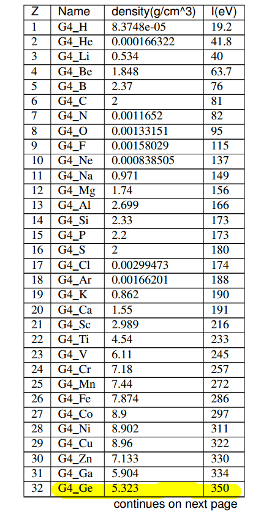

# HPGe效率刻度Geant4模拟
模拟过程主要基于exampleB1，通过能量沉积获得模拟得到的输出谱。

root输出统计主要参考AnaEx01，目前统计在./rootfile里，后续还会继续改进。

目前还有在endofeventaction直接判断能量沉积的输出方式。
# Ge使用自带材料G4_Ge，井型高纯锗

# 可能的改进
1. 锗晶体材料，Geant4中Appendix的I是什么能量，高纯锗平均电离能应该是2-3eV之间，如果电离能数据有误对效率有极大影响
2. 锗晶体deadlayer以及井型窗口的材料。井型窗口为铝材但厚度未知，内壁deadlayer为B注入，已经将内壁材料设置为B并且未统计deadlayer的能量沉积。可以考虑编写掺杂。
3. 锗晶体的温度。温度应该只对电子学噪声有影响吧...本模拟未设置温度。
4. 高斯展宽。本代码目前没加高斯展宽。高斯展宽就只是让谱看起来更像实际谱。吧？对效率应该没有影响。吧？
5. 关于physiclist。直接使用B1的physiclist,没有细看。可能可以有物理过程的改进。GEANT4官网关于QBBCphysiclist的描述：
> It is recommended for medical and space physics simulations.

# 使用过程
1. 使用方式参阅./cmakemakerunFor.sh以及./rootfile/eff.cpp, ./rootfile/efficiency.cpp
2. 主要GEANT4代码在include和src中。

# 感谢
感谢CERN的GEANT4和root, 可是我不会用;

感谢Microsoft的vscode， 可是我只会用一点点;

感谢同门师兄，和老师。